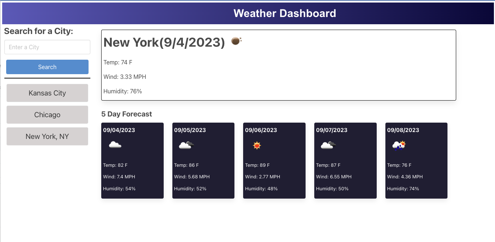

<!-- ABOUT THE PROJECT -->
# About The Project
#### Weather Dashboard  
This is assignment number 6 of the UC-Irvine coding bootcamp  
The Following User Story and acceptance criteria were provided for this assignment:

## User Story
AS A traveler  
I WANT to see the weather outlook for multiple cities  
SO THAT I can plan a trip accordingly  

## Acceptance Criteria

GIVEN a weather dashboard with form inputs 
WHEN I search for a city 
THEN I am presented with current and future conditions for that city and that city is added to the search history 
WHEN I view current weather conditions for that city 
THEN I am presented with the city name, the date, an icon representation of weather conditions, the temperature, the humidity, and the wind speed 
WHEN I view future weather conditions for that city  
THEN I am presented with a 5-day forecast that displays the date, an icon representation of weather conditions, the temperature, the wind speed, and the humidity 
WHEN I click on a city in the search history  
THEN I am again presented with current and future conditions for that city  

(<a href="#readme-top">back to top</a>)

---  

---

# Built With

* HTML
* CSS
* [jQuery](https://JQuery.com)
* [Day.js](https://day.js.org/)
* [Open Weather Map API](https://openweathermap.org/)
* [CSS Framework Bulma](https://bulma.io/documentation/components/modal/)

(<a href="#readme-top">back to top</a>)

<!-- LICENSE -->
# License

Distributed under the MIT License. See `LICENSE.txt` for more information.

(<a href="#readme-top">back to top</a>)

<!-- Project Links -->
# Project Links

* [Live Site](https://ultimated1228.github.io/Work-Day-Scheduler/)  
* [Repo Link](https://github.com/ultimated1228/weather-app)

(<a href="#readme-top">back to top</a>)

# Final Product Screenshot

(<a href="#readme-top">back to top</a>)
